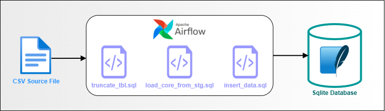
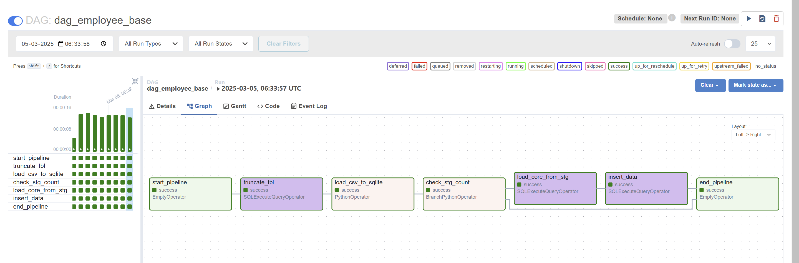
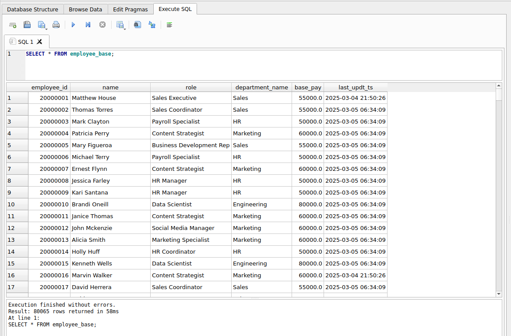

# Airflow ETL Pipeline with SQLite

This project demonstrates an ETL (Extract, Transform, Load) pipeline using Apache Airflow and SQLite. 
The pipeline extracts data from a CSV file, transforms it, and loads it into staging and core tables.

## Overview
### Description
The Sqlite DB contains three core tables:
- **employee_detail:** Stores employee records, including a unique ID `employee_id`, employee name `name`, job role `role`, and department ID `dept_id`, with a foreign key linking to **department_detail** table to maintain departmental associations.
- **department_detail:** Stores department-specific information, including a unique identifier `dept_id`, the department name `department_name`, and its associated base salary `base_pay`
- **employee_base:** Stores combined employee salary data by joining between **employee_detail** and **department_detail** tables.

A CSV file containing data of new employees is stored in the `/data` folder.

The ETL pipeline is used to load this CSV source data into **employee_detail** via a staging table **employee_detail_stg**, after which the **employee_base** table is loaded by running a SQL query, which appends the resultant data to the core table.

### Overview Diagram

### DAG Flow

### Core Table Output

## Prerequisites
1. [Ubuntu on WSL](https://ubuntu.com/desktop/wsl)
2. [Installation & Configuring Airflow in WSL](https://vivekjadhavr.medium.com/how-to-easily-install-apache-airflow-on-windows-6f041c9c80d2)
3. [Setting up sqlite3 in WSL](https://www.digitalocean.com/community/tutorials/how-to-install-and-use-sqlite-on-ubuntu-20-04)
4. [Installing DB Browser for sqlite in WSL](https://github.com/sqlitebrowser/sqlitebrowser)

## Repository Structure
- **assets/**: Contains images used in the README for visual representation of the pipeline.
- **dags/**: Contains the DAG definition and related configuration, data, and SQL scripts.
  - **config/**: Contains YAML configuration files for the DAGs.
  - **data/**: Contains raw data files.
  - **sql/**: Contains SQL scripts for loading and transforming data.
- **setup/**: Contains setup scripts for initializing the environment.
- **table-ddls/**: Contains SQL scripts for creating database tables.