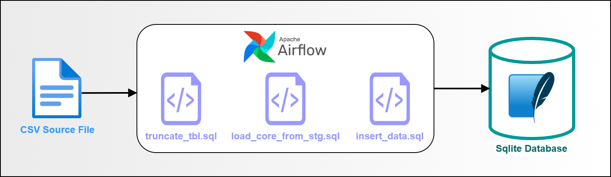

# Airflow ETL Pipeline with SQLite

This project demonstrates an ETL (Extract, Transform, Load) pipeline using Apache Airflow and SQLite. 
The pipeline extracts data from a CSV file, transforms it, and loads it into staging and core tables.

## Overview
### Diagram

### DAG Flow

### Core Table Output

## Prerequisites
1. [Ubuntu on WSL](https://ubuntu.com/desktop/wsl)
2. [Installation & Configuring Airflow in WSL](https://vivekjadhavr.medium.com/how-to-easily-install-apache-airflow-on-windows-6f041c9c80d2)
3. [Setting up sqlite3 in WSL](https://www.digitalocean.com/community/tutorials/how-to-install-and-use-sqlite-on-ubuntu-20-04)
4. [Installing DB Browser for sqlite in WSL](https://github.com/sqlitebrowser/sqlitebrowser)
